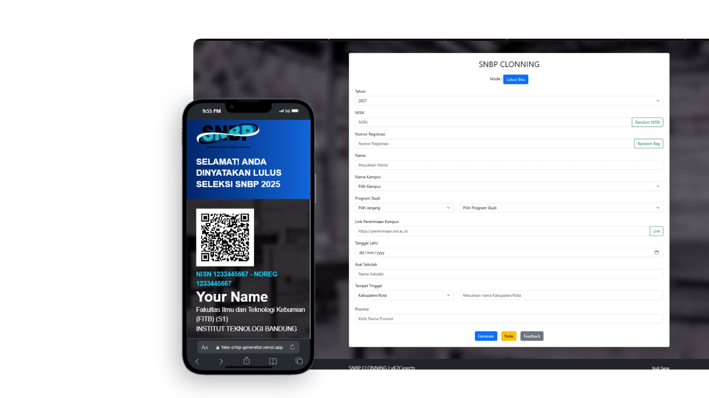

  

# SNBP Clonning

Hi guys, I was inspired by the GitHub of `@anuGrahBodi` for this SNBP Clonning website, so here I want to recreate or copy the website by tidying up the main page to make it neater and more beautiful.

> [!WARNING]
> once again, I can't just copy other people's projects, I also make changes

The Tech Stack that I use here is 3, namely:  

   

and also using `cdnjs fontawesome and qrcode`:

- `🔐 font:  `
- `🔐 qrcode:  `

## Website Features

The following are the features displayed on the `SNBP Clonning website`:

- 🎯 Select Pass/Fail mode with Pass=>Blue, Fail=>Red
- 🎯 Select the year you want to display in the header
- 🎯 Enter fake NISN number
- 🎯 Enter registration number
- 🎯 Enter real/fake name
- 🎯 Select desired Campus/University
- 🎯 Select study program, such as level and faculty you want to choose
- 🎯 Fill in fake campus admission link
- 🎯 Fill in date of birth
- 🎯 Fill in school/fake name
- 🎯 Select place of residence, district/city and district/city name
- 🎯 Enter province name

## Hosting Wsbite 
I host my website with `vercel`   

> [!NOTE]
>
> This website will continue to grow
